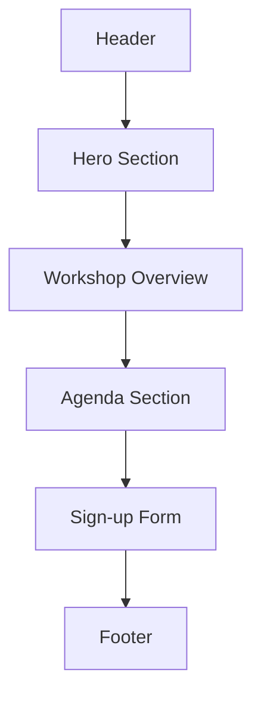
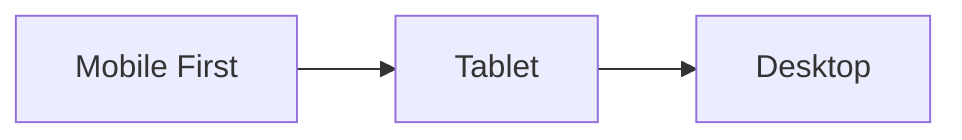

# Workshop Landing Page Plan: Agentic AI Fundamentals for Product Managers

## 1. Project Structure

```
workshop-landing-page/
├── index.html          # Main landing page
├── css/
│   ├── styles.css      # Main stylesheet
│   └── normalize.css   # CSS reset for cross-browser consistency
├── js/
│   └── main.js         # JavaScript for form validation and submission
├── tests/              # Test files following TDD principles
│   ├── unit/           # Unit tests for JavaScript functions
│   ├── integration/    # Integration tests for form submission
│   ├── accessibility/  # Accessibility tests
│   └── responsive/     # Responsive design tests
├── images/             # Directory for any images/icons
└── README.md           # Project documentation
```

## 2. Page Sections & Content Structure



### Header
- Simple navigation (if needed)
- Workshop title

### Hero Section
- Workshop title: "Agentic AI Fundamentals for Product Managers"
- Date, time, and location: July 15, 2025, 9 AM - 4 PM, Downtown Tech Hub
- Brief compelling description
- "Register Now" CTA button that jumps to the sign-up form

### Workshop Overview
- Target audience: Product Managers
- Key benefits of attending
- What attendees will learn
- Brief description of the workshop format

### Agenda Section
- Detailed timeline with session descriptions:
  - 9:00 – 9:15: Welcome & Keynote
  - 9:15 – 10:00: Environment Setup
  - 10:00 – 10:45: Exploring Agentic Concepts
  - 10:45 – 11:00: Break
  - 11:00 – 12:00: Guided Lab: Build Your First Agent
  - 12:00 – 1:00: Lunch & Networking
  - 1:00 – 1:45: Prototype Enhancement
  - 1:45 – 2:30: Low-Code Agent Workshop
  - 2:30 – 2:45: Break
  - 2:45 – 3:30: Agent Testing & Iteration
  - 3:30 – 4:00: Wrap-up & Next Steps

### Sign-up Form
- Simple form with:
  - Name field (required)
  - Email field (required)
  - Submit button
- Form validation
- Success message after submission

### Footer
- Contact information
- Copyright notice

## 3. Technical Implementation

### HTML Structure
- Semantic HTML5 elements
- Responsive meta tags
- Proper heading hierarchy
- Accessibility considerations (ARIA attributes, alt text)

### CSS Approach
- Mobile-first responsive design
- Flexbox/Grid for layouts
- CSS variables for consistent color scheme:
  - Neutral colors (whites, grays) as base
  - Accent colors for important elements and CTAs
- Minimalist design with focus on readability
- Smooth transitions and hover effects

### JavaScript Functionality
- Form validation
- Smooth scrolling to sections
- Form submission handling
  - Store emails (could use local storage for demo or connect to a backend service)
  - Display success message

## 4. Security Measures for Form Inputs

### Input Validation & Sanitization
- Client-side validation using JavaScript:
  - Email format validation
  - Required field validation
  - Input length restrictions
- Server-side validation (when implemented)
- Sanitize all user inputs to prevent XSS attacks:
  - Escape special characters
  - Remove potentially malicious code
- Implement proper input field types and patterns:
  - `type="email"` for email fields
  - `pattern` attributes for specific formats

### Anti-Spam & Bot Protection
- Add a honeypot field:
  - Hidden field that humans won't see/fill but bots will
  - CSS to hide from humans: `display: none;`
  - Check if field is empty on submission
- Implement a simple CAPTCHA or reCAPTCHA:
  - Consider reCAPTCHA v3 for less intrusive user experience
  - Fallback to simpler methods if needed
- Add rate limiting for form submissions:
  - Track submissions by IP address
  - Implement cooldown period between submissions
  - Block excessive attempts

### Additional Security Measures
- CSRF token protection:
  - Generate unique token for each form
  - Validate token on submission
- Proper error handling:
  - Generic error messages to users
  - Detailed logging for administrators
  - No exposure of sensitive information
- Secure storage of submitted data:
  - Encryption for sensitive information
  - Proper access controls
  - Data minimization (only collect what's needed)

## 5. Test-Driven Development Approach

### Testing Strategy

Following TDD principles, we will:
1. Write tests before implementing features
2. Run tests to confirm they fail (red phase)
3. Implement the minimum code to pass tests (green phase)
4. Refactor code while ensuring tests still pass (refactor phase)
5. Repeat for each feature

### Types of Tests

#### Unit Tests
- Test individual JavaScript functions in isolation
- Form validation functions
- Email format validation
- Required field validation
- Form submission handler
- CSRF token generation and validation

#### Integration Tests
- Test the interaction between components
- Form submission flow
- Success message display
- Error handling

#### Accessibility Tests
- Test compliance with WCAG guidelines
- Proper semantic HTML structure
- ARIA attributes
- Keyboard navigation
- Screen reader compatibility

#### Responsive Design Tests
- Test layout and functionality across different screen sizes
- Mobile breakpoints
- Tablet breakpoints
- Desktop breakpoints

#### Security Tests
- Test form security measures
- XSS protection
- CSRF protection
- Input sanitization
- Honeypot field functionality

### Testing Tools & Framework
- Simple testing setup using Jest for JavaScript unit tests
- HTML validation using W3C Validator
- CSS validation using W3C CSS Validator
- Accessibility testing using Lighthouse or axe
- Manual testing for responsive design using browser dev tools

## 6. Responsive Design Considerations



- Mobile: Single column layout, stacked sections
- Tablet: Two-column layout for some sections
- Desktop: Multi-column layout with optimized spacing

## 7. Form Submission Handling

For this demo, we'll implement a simple client-side form handling solution:

1. Validate form inputs (name and email)
2. Prevent default form submission
3. Store submission in browser's localStorage (simulating a database)
4. Display success message
5. Clear form fields

In a production environment, this would be connected to a backend service.

## 8. Performance Considerations

- Optimize images
- Minify CSS and JavaScript
- Implement lazy loading for images
- Use appropriate image formats (WebP with fallbacks)

## 9. Implementation Timeline (TDD Approach)

1. Set up project structure and testing environment
2. Write HTML structure tests:
   - Test for required sections
   - Test for semantic HTML elements
   - Test for accessibility features
3. Implement HTML structure to pass tests
4. Write CSS tests:
   - Test for responsive breakpoints
   - Test for color scheme consistency
   - Test for layout requirements
5. Implement CSS to pass tests
6. Write JavaScript functionality tests:
   - Test form validation
   - Test form submission
   - Test security measures
7. Implement JavaScript to pass tests
8. Continuous testing throughout development
9. Performance optimization
10. Final review and adjustments